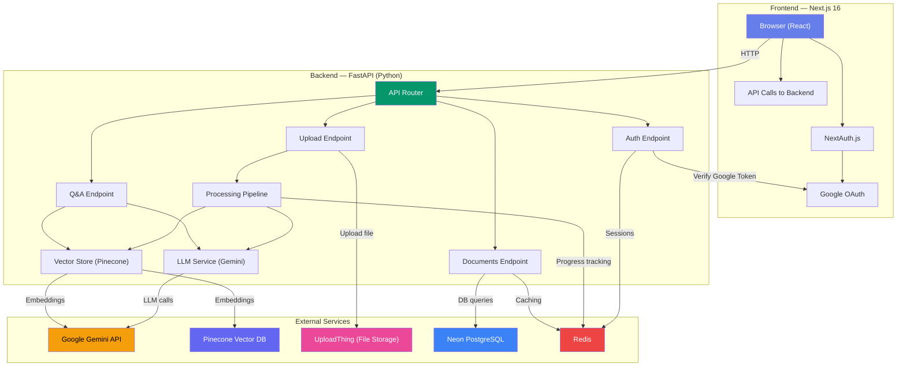
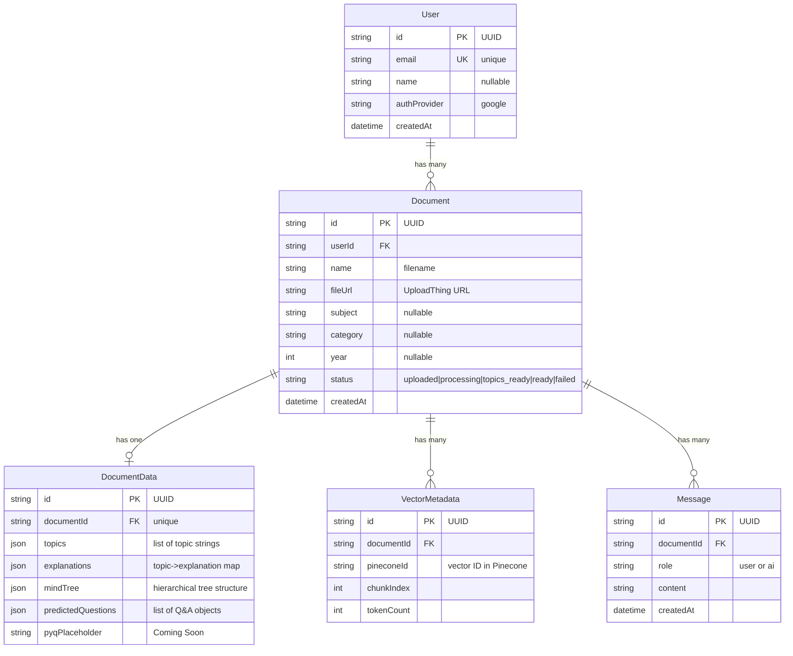
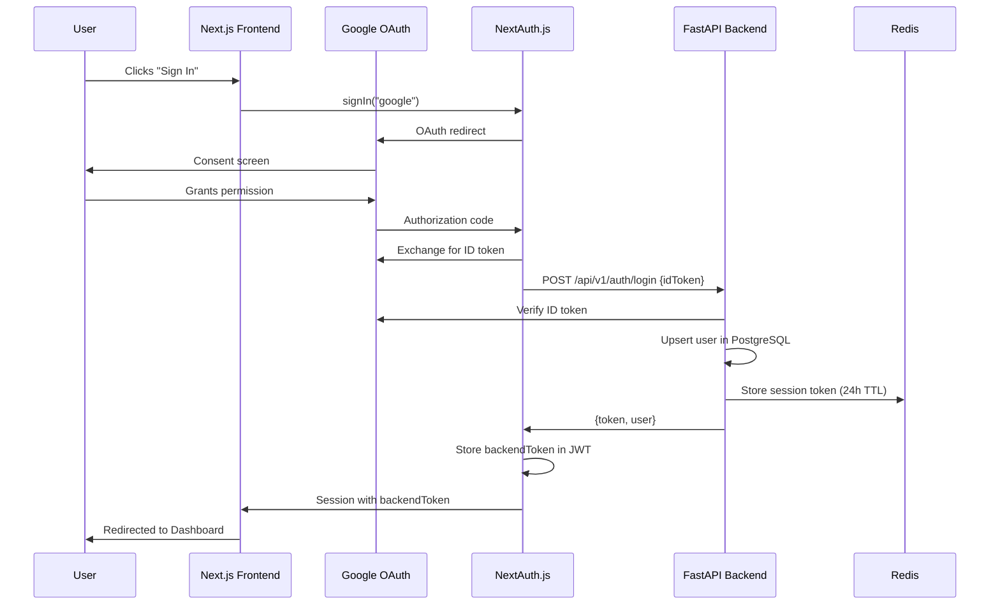
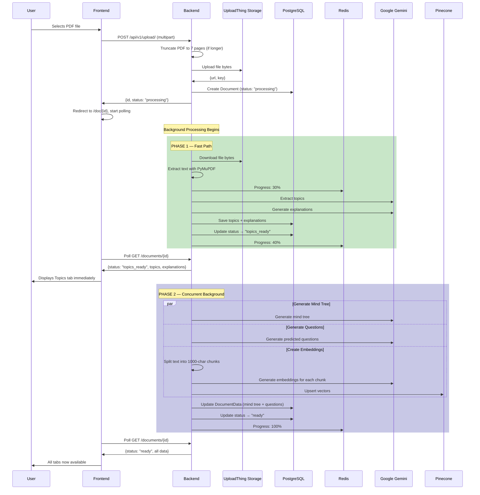
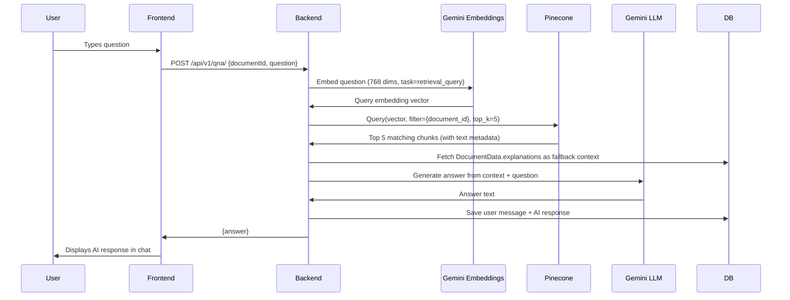

# ConvoDoc-AI (CurioBot) — Complete Project Walkthrough

## What Is This Project?

**ConvoDoc-AI** is an **AI-powered study assistant** that transforms uploaded PDF documents into interactive learning experiences. When a student uploads a PDF, the system:

1. **Extracts key topics** and generates detailed explanations
2. **Builds an interactive mind map** visualizing concept hierarchies
3. **Predicts exam questions** with answers
4. **Provides a RAG-based AI Q&A chat** — students can ask questions and get answers grounded in the document's actual content

In short: **Upload a PDF → Get a full study toolkit automatically.**

---

## High-Level Architecture



---

## Technology Stack — Every Technology & Why

### Frontend

| Technology | Version | Why It's Used |
|---|---|---|
| **Next.js** | 16.0.5 | React meta-framework providing SSR, file-based routing (App Router), API routes, and server-side rendering. The App Router handles page routing (`/`, `/dashboard`, `/upload`, `/doc/[id]`) |
| **React** | 19.2.0 | UI component library. Everything the user sees is a React component |
| **TypeScript** | ^5 | Adds static types to JavaScript, catching bugs at compile time instead of runtime |
| **Tailwind CSS** | ^4.1.17 | Utility-first CSS framework for rapid styling. Every `className="text-gray-800 p-6"` is Tailwind |
| **NextAuth.js** | ^4.24.13 | Authentication library that handles Google OAuth sign-in flow, JWT session management, and token handling. Provides `useSession()` hook for checking auth state |
| **React Flow (`@xyflow/react`)** | ^12.9.3 | Interactive node-graph/flowchart library used to render the **Mind Map**. Nodes are concept boxes, edges are connections between them |
| **Framer Motion** | ^12.23.24 | Animation library for smooth page transitions, component mounting/unmounting animations, and micro-interactions |
| **GSAP** | ^3.13.0 | Additional animation library (installed but primarily Framer Motion is used) |
| **Lucide React** | ^0.555.0 | Icon library providing all icons (Upload, Search, Brain, ChevronRight, etc.) |
| **clsx + tailwind-merge** | ^2.1.1 / ^3.4.0 | Utility for conditionally joining CSS class names and resolving Tailwind conflicts |

### Backend

| Technology | Version | Why It's Used |
|---|---|---|
| **FastAPI** | latest | Python async web framework. Provides automatic OpenAPI docs, dependency injection (`Depends()`), background tasks, and async request handling |
| **Uvicorn** | latest | ASGI server that actually runs the FastAPI app. Handles HTTP connections |
| **Prisma (prisma-client-py)** | latest | Type-safe ORM for PostgreSQL. Generates a Python client from `schema.prisma` with full async support. Handles all DB operations |
| **Google Generative AI** | latest | Official Google SDK for calling Gemini LLM models. Used for topic extraction, explanations, mind maps, predicted questions, Q&A answers, AND text embeddings |
| **Pinecone** | latest | Managed vector database. Stores document embeddings for semantic search during RAG-based Q&A |
| **Redis** | latest | In-memory data store used for: (1) session storage, (2) processing progress tracking, (3) document data caching |
| **PyMuPDF (fitz)** | latest | PDF parsing library. Extracts raw text from uploaded PDF documents |
| **LangGraph** | latest | AI workflow orchestration library (from LangChain ecosystem). Defines a state-machine graph for sequential analysis steps (topics → explanations → mind tree → questions). Currently kept as a utility/alternative to the main concurrent pipeline |
| **Pydantic Settings** | latest | Configuration management. Loads and validates environment variables into a typed `Settings` class |
| **httpx** | latest | Async HTTP client for making requests to UploadThing API |
| **sqids** | latest | ID generation library used to generate UploadThing-compatible file keys |
| **python-multipart** | latest | Required by FastAPI for handling file uploads (`multipart/form-data`) |

### Infrastructure & External Services

| Service | Why It's Used |
|---|---|
| **Docker + Docker Compose** | Containerizes the entire stack (frontend, backend, Redis) for consistent deployment. One `docker-compose up` starts everything |
| **Neon PostgreSQL** | Serverless Postgres database (cloud-hosted). Stores users, documents, document analysis data, chat messages, and vector metadata |
| **UploadThing** | File storage service. Uploaded PDFs are stored here and accessed via public URLs |
| **Google Cloud (OAuth)** | Google OAuth 2.0 provides the authentication mechanism. Users sign in with their Google accounts |
| **Google Gemini API** | The AI brain. `gemini-3.1-flash-lite-preview` model handles all text generation. `gemini-embedding-001` creates vector embeddings |
| **Pinecone** | Vector database storing document chunk embeddings in 768-dimensional space for semantic similarity search |

---

## Database Schema — The Data Model



### Why Each Table Exists

- **User**: Stores authenticated users (from Google OAuth). One user → many documents.
- **Document**: Metadata about each uploaded file — name, storage URL, processing status. The `status` field drives the entire frontend UI (showing loading, partial results, or full results).
- **DocumentData**: The AI-generated analysis output. Stored as JSON fields because the structure is dynamic (variable number of topics, tree nodes, questions).
- **VectorMetadata**: Tracks which Pinecone vector IDs belong to which document, enabling cleanup when documents are deleted.
- **Message**: Chat history for the Q&A feature. Persisted so users can return and see past conversations.

---

## Complete User Flow — Step by Step

### 1. Authentication Flow



**Key Details:**
- Google OAuth is configured with `prompt: "consent"` and `access_type: "offline"` to ensure fresh tokens
- The backend verifies the Google ID token using `google.oauth2.id_token.verify_oauth2_token()` with a `clock_skew_in_seconds=10` allowance for Docker container time drift
- A UUID session token is generated and stored in Redis with a 24-hour TTL
- This session token (not the Google token) is used for all subsequent API calls as a Bearer token

### 2. Document Upload & Processing Flow



**Key Design Decisions:**
- **7-page truncation**: PDFs are limited to 7 pages to stay within Gemini token limits and keep processing fast
- **Two-phase processing**: Topics and explanations are generated first (Phase 1) so students see useful content quickly, while mind maps, questions, and embeddings run concurrently in Phase 2
- **Progress tracking via Redis**: The frontend polls every 2-3 seconds, and Redis stores a progress percentage (10% → 20% → 30% → 40% → 90% → 100%) so the loading screen shows real progress
- **`asyncio.gather()`** is used in Phase 2 to run mind tree generation, question prediction, and vector embedding in parallel — significantly reducing total processing time

### 3. RAG-Based Q&A Flow



**How RAG Works Here:**
1. The user's question is converted into a 768-dimensional vector using Gemini's embedding model (`gemini-embedding-001`) with `task_type="retrieval_query"`
2. This vector is searched against Pinecone (which has the document's chunks embedded with `task_type="retrieval_document"`) — the different task types optimize for asymmetric search
3. The top 5 most semantically similar chunks are retrieved
4. These chunks + the original question are sent to Gemini LLM to generate a grounded answer
5. Both the question and answer are saved to the `messages` table for chat history persistence

---

## Project File Structure — Every File Explained

### Root Level

```
Curiobot/
├── docker-compose.yml          # Development: mounts local code, enables hot-reload
├── docker-compose.prod.yml     # Production: no volume mounts, optimized builds
├── README.md                   # Project documentation with screenshots
└── deployment_guide.md         # Deployment instructions
```

---

### Backend (`backend/`)

```
backend/
├── main.py                     # FastAPI app entry point
├── Dockerfile                  # Python 3.10-slim, installs deps, generates Prisma client
├── requirements.txt            # All Python dependencies
├── .env                        # API keys and database URL
├── prisma/
│   └── schema.prisma           # Database schema definition (5 models)
└── app/
    ├── api/
    │   ├── api.py              # Central router — mounts all endpoint routers
    │   └── endpoints/
    │       ├── auth.py         # POST /login — Google token verification, session creation
    │       ├── upload.py       # POST / — File upload, truncation, background processing trigger
    │       ├── documents.py    # GET /, GET /{id}, DELETE /{id} — CRUD with Redis caching
    │       └── qna.py          # POST /, GET/DELETE /history/{id} — RAG Q&A
    ├── core/
    │   ├── config.py           # Pydantic Settings — loads .env into typed config
    │   ├── redis.py            # Redis client wrapper (connect, get, set, delete)
    │   └── security.py         # Bearer token auth middleware — validates session via Redis
    ├── db/
    │   └── prisma.py           # Prisma client singleton (connect/disconnect lifecycle)
    └── services/
        ├── llm.py              # All Gemini LLM calls (topics, explanations, mind tree, questions)
        ├── vector_store.py     # Pinecone operations (upsert embeddings, query for RAG)
        ├── processing.py       # Two-phase document processing pipeline
        ├── analysis.py         # LangGraph workflow (alternative sequential pipeline)
        ├── uploadthing_storage.py  # UploadThing file operations (upload, download, delete)
        └── gcs.py              # Google Cloud Storage (legacy, not actively used)
```

---

### Frontend (`frontend/`)

```
frontend/
├── Dockerfile                  # Multi-stage build: Node 20 → build → standalone server
├── Dockerfile.dev              # Development: just runs `npm run dev`
├── package.json                # Dependencies and scripts
├── tailwind.config.ts          # Tailwind customization
├── next.config.ts              # Next.js configuration
├── .env                        # Google OAuth credentials, API URLs
└── src/
    ├── app/
    │   ├── layout.tsx          # Root layout — wraps everything in Providers, Navbar, Footer
    │   ├── page.tsx            # Homepage — Hero, Features, CTA, FAQ sections
    │   ├── globals.css         # Neumorphic design system (neo-shadow, neo-inset, neo-btn)
    │   ├── api/auth/[...nextauth]/
    │   │   └── route.ts        # NextAuth config — Google provider, JWT callbacks, backend login bridge
    │   ├── auth/signin/        # Custom sign-in page
    │   ├── dashboard/
    │   │   └── page.tsx        # Document library — grid of DocumentCards with search
    │   ├── upload/
    │   │   └── page.tsx        # Upload page — drag-and-drop file upload
    │   └── doc/[id]/
    │       └── page.tsx        # Document detail — polling, tab switching, mind map modal
    ├── components/
    │   ├── Providers.tsx        # SessionProvider wrapper (client component boundary)
    │   ├── Navbar.tsx           # Top navigation bar with auth state
    │   ├── Footer.tsx           # Page footer
    │   ├── Upload.tsx           # File upload form with drag-and-drop
    │   ├── DocumentCard.tsx     # Card component for dashboard document grid
    │   ├── MindMap.tsx          # Interactive mind map using React Flow (384 lines)
    │   ├── LoadingScreen.tsx    # Progress-bar loading screen during processing
    │   ├── navbar/
    │   │   ├── ProfileDropdown.tsx  # User avatar dropdown with sign-out
    │   │   └── MobileMenu.tsx      # Hamburger menu for mobile
    │   ├── home/
    │   │   ├── Hero.tsx         # Landing page hero section
    │   │   ├── Features.tsx     # Feature showcase cards
    │   │   ├── CTA.tsx          # Call-to-action section
    │   │   └── FAQ.tsx          # Frequently asked questions
    │   └── doc/
    │       ├── DocumentTabBar.tsx    # Tab navigation (Topics, Q&A, Predicted, Previous)
    │       ├── PdfViewer.tsx         # Embedded PDF viewer (iframe)
    │       ├── ProcessingBanner.tsx  # "Still processing..." banner with progress
    │       ├── TabLoadingPlaceholder.tsx  # Skeleton loader for tabs
    │       └── tabs/
    │           ├── TopicsTab.tsx      # Displays extracted topics with explanations
    │           ├── QnaTab.tsx         # AI chat interface with message history
    │           ├── MindMapTab.tsx     # Wrapper for the MindMap component
    │           ├── PredictedTab.tsx   # Shows predicted exam questions and answers
    │           └── PreviousTab.tsx    # Previous year questions (placeholder)
    └── lib/
        ├── utils.ts             # cn() utility for merging Tailwind classes
        └── renderText.tsx       # Text rendering with bold/paragraph formatting
```

---

## Design System — Neumorphism

The UI uses a **neumorphic** (soft UI) design system built on a light gray base (`#e0e5ec`):

| CSS Class | Effect | Used For |
|---|---|---|
| `neo-shadow` | Raised/elevated look with light+dark shadow | Cards, buttons, containers |
| `neo-inset` | Pressed-in/sunken look with inner shadows | Input fields, chat areas |
| `neo-btn` | Button with gradient + raised shadow, inverts on click | All action buttons |

The primary color is `#667eea` (soft indigo-blue), and the entire app has animated background blobs (purple, yellow, pink circles with `blur-3xl` and `mix-blend-multiply`) for a modern, dynamic feel.

---

## Key Backend Services — Deep Dive

### [llm.py](file:///c:/Users/DELL/OneDrive/Desktop/MAJOR%20PROJECT/Curiobot/backend/app/services/llm.py) — The AI Brain

Uses **Gemini 3.1 Flash Lite Preview** for all text generation. Contains 4 core functions:

- **`extract_topics(text)`** — Sends first 10,000 chars of document text → returns JSON list of topic strings
- **`generate_explanations(text, topics)`** — For each extracted topic, generates a detailed explanation → returns `{topic: explanation}` dict
- **`generate_mind_tree(text)`** — Generates a hierarchical tree structure (`{name, children}` format) for visualization
- **`generate_predicted_questions(text)`** — Creates 5 exam-style Q&A pairs → returns `[{question, answer}]` list

The `_parse_json()` helper is robust: it strips `<think>` blocks from reasoning models, extracts JSON from markdown code fences, and falls back to bracket-matching as a last resort.

Since `google-generativeai`'s `generate_content` is synchronous, it's run via `loop.run_in_executor()` to avoid blocking the async event loop.

### [vector_store.py](file:///c:/Users/DELL/OneDrive/Desktop/MAJOR%20PROJECT/Curiobot/backend/app/services/vector_store.py) — RAG Foundation

- **`generate_embedding(text)`** — Uses `gemini-embedding-001` with 768 output dimensions and `retrieval_document` task type
- **`upsert_vectors(document_id, chunks)`** — Embeds each text chunk and uploads to Pinecone with metadata (document_id, text, chunk_index)
- **`query_vectors(query, filter, top_k=5)`** — Embeds the query with `retrieval_query` task type and searches Pinecone with document-scoped filtering

### [processing.py](file:///c:/Users/DELL/OneDrive/Desktop/MAJOR%20PROJECT/Curiobot/backend/app/services/processing.py) — The Processing Pipeline

The most critical service. Runs as a **FastAPI BackgroundTask** with two phases:

**Phase 1 (Fast Path):**
1. Download file from UploadThing
2. Extract text with PyMuPDF
3. Extract topics via Gemini
4. Generate explanations via Gemini
5. Save to DB → set status to `topics_ready`

**Phase 2 (Concurrent Background):**
1. `asyncio.gather()` runs three tasks in parallel:
   - Mind tree generation (Gemini LLM)
   - Predicted questions (Gemini LLM)
   - Vector embedding + Pinecone upsert
2. Save remaining data → set status to `ready`

Both save functions have **retry logic** (3 attempts with 1-second delays) to handle transient DB connection issues.

### [uploadthing_storage.py](file:///c:/Users/DELL/OneDrive/Desktop/MAJOR%20PROJECT/Curiobot/backend/app/services/uploadthing_storage.py) — File Storage

A complete Python implementation of the UploadThing v7 SDK protocol:
- Decodes the base64 `UPLOADTHING_TOKEN` to extract API key, app ID, and region
- Generates file keys using SQIDs with DJB2 hashing (replicating the JavaScript SDK exactly)
- Creates HMAC-SHA256 presigned URLs for secure uploads
- Handles upload, download, and delete operations

### [analysis.py](file:///c:/Users/DELL/OneDrive/Desktop/MAJOR%20PROJECT/Curiobot/backend/app/services/analysis.py) — LangGraph Workflow

Defines a **LangGraph StateGraph** with 4 sequential nodes:
```
extract_topics → generate_explanations → generate_mind_tree → generate_questions
```

This is kept as an **alternative pipeline** — the main `processing.py` now uses a faster concurrent approach, but this provides a clean, composable workflow definition that could be useful for experimentation.

---

## Docker Architecture

### Development (`docker-compose.yml`)

- **Backend**: Mounts `./backend:/app` for live code reloading with `uvicorn --reload`
- **Frontend**: Mounts `./frontend:/app` for Next.js hot module replacement
- **Redis**: Alpine image, no persistence
- All three share an `app-network` bridge network for inter-container DNS (`backend:8000`, `redis:6379`)

### Production (`docker-compose.prod.yml`)

- **No volume mounts** — code is baked into images
- **Pre-built images** tagged for Docker Hub (`harshsrivastava05/convodocai-*`)
- **Redis data persistence** via named volume `redis-data`
- Frontend uses multi-stage Dockerfile (build → standalone)

---

## Environment Variables Summary

### Backend `.env`
| Variable | Purpose |
|---|---|
| `DATABASE_URL` | Neon PostgreSQL connection string with PgBouncer pooling |
| `GEMINI_API_KEY` | Google Gemini API key for LLM + embeddings |
| `PINECONE_API_KEY` | Pinecone vector database API key |
| `PINECONE_ENV` | Pinecone region (`us-east-1`) |
| `UPLOADTHING_TOKEN` | Base64 token containing API key, app ID, regions |
| `REDIS_URL` | Redis connection URL |
| `GOOGLE_CLIENT_ID` | For verifying Google OAuth tokens server-side |

### Frontend `.env`
| Variable | Purpose |
|---|---|
| `GOOGLE_CLIENT_ID` | Google OAuth client ID |
| `GOOGLE_CLIENT_SECRET` | Google OAuth client secret |
| `NEXTAUTH_SECRET` | JWT encryption secret for NextAuth sessions |
| `NEXTAUTH_URL` | Canonical URL for NextAuth callbacks |
| `NEXT_PUBLIC_API_URL` | Backend API URL (exposed to browser) |

---

## Summary

This is a well-architected full-stack AI application that combines:
- **Modern frontend patterns** (Next.js App Router, neumorphic design, real-time polling)
- **AI/ML pipeline** (Gemini LLM for generation, Gemini embeddings + Pinecone for RAG)
- **Production-ready infrastructure** (Docker, connection pooling, Redis caching, retry logic)
- **Smart UX design** (two-phase processing so users see results quickly, persistent chat history)
